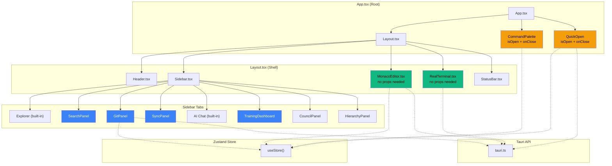

# خوارزميات ربط شامل — BI-IDE v8 Supreme
## Complete Integration Algorithms (Verified Edition)

> **الهدف**: ربط كل المكونات المعزولة (14+ كومبوننت) بالواجهة الرئيسية
> **آخر تحديث**: 2026-03-02 — مراجعة وتصحيح APIs الفعلية
> **الوقت المقدر**: ساعة واحدة (3 ملفات تعديل)

---

## 📊 جدول المكونات غير المربوطة

### الطبقة 1: Desktop App (التعديلات المطلوبة)

| الكمبوننت | الحجم | Props الفعلي | مكان الربط | الأولوية |
|-----------|-------|-------------|-----------|---------|
| `MonacoEditor.tsx` | 363 سطر | `{ className? }` | `Layout.tsx` ← يستبدل `Editor.tsx` | 🔴 P0 |
| `RealTerminal.tsx` | 280 سطر | بدون props | `Layout.tsx` ← يستبدل `Terminal.tsx` | 🔴 P0 |
| `CommandPalette.tsx` | 637 سطر | `{ isOpen, onClose }` | `App.tsx` ← Ctrl+Shift+P | 🔴 P0 |
| `QuickOpen.tsx` | 305 سطر | `{ isOpen, onClose }` | `App.tsx` ← Ctrl+P | 🔴 P0 |
| `GitPanel.tsx` | 331 سطر | بدون props | `Sidebar.tsx` ← تبويب Git | 🟡 P1 |
| `SearchPanel.tsx` | ~200 سطر | بدون props | `Sidebar.tsx` ← تبويب Search | 🟡 P1 |
| `SyncPanel.tsx` | ~250 سطر | بدون props | `Sidebar.tsx` ← تبويب Sync (جديد) | 🟡 P1 |
| `TrainingDashboard.tsx` | ~300 سطر | بدون props | `Sidebar.tsx` ← تبويب Training | 🟡 P1 |
| `WorkerPolicyPanel.tsx` | ~200 سطر | بدون props | `Sidebar.tsx` ← تبويب Workers (جديد) | 🟢 P2 |
| `ERPDashboard.tsx` | ~250 سطر | بدون props | `Header.tsx` ← زر ERP (مستقبلي) | 🟢 P2 |
| `SettingsPanel.tsx` | ~200 سطر | بدون props | `Header.tsx` ← زر Settings | 🟢 P2 |
| `UpdateManager.tsx` | ~150 سطر | بدون props | `App.tsx` ← On mount | 🟢 P2 |
| `AICompletionProvider.tsx` | ~200 سطر | داخلي | مدمج بـ `MonacoEditor.tsx` تلقائياً | ✅ مدمج |
| `LearningDashboard.tsx` | ~200 سطر | بدون props | `Sidebar.tsx` ← مستقبلي | 🟢 P2 |

### ملاحظة حرجة

> **كل الكمبوننتس self-contained** — تقرأ من Zustand store (`useStore()`) وتتصل بـ `tauri.ts` مباشرة.
> لا نحتاج نمرر لها props كثيرة. فقط `isOpen` و `onClose` للـ modals.

---

## 🔧 خوارزمية 1: ربط Monaco Editor (P0)

### الوصف
استبدال `Editor.tsx` (textarea بسيط 176 سطر) بـ `MonacoEditor.tsx` (محرر احترافي 363 سطر)

### ماذا يوفر MonacoEditor تلقائياً
- ✅ Syntax highlighting لـ 30+ لغة
- ✅ File tabs مع dirty state
- ✅ Auto-save مع debounce
- ✅ Line numbers + minimap
- ✅ AI inline completion (مربوط بـ `ai.getCompletion()`)
- ✅ Keyboard shortcuts (Ctrl+S, Ctrl+W, Ctrl+Tab)

### التعديل المطلوب في Layout.tsx

```diff
-import { Editor } from "./Editor";
+import { MonacoEditor } from "./editor/MonacoEditor";

 {/* Editor Area */}
 <div className="flex-1 overflow-hidden">
-  <Editor />
+  <MonacoEditor />
 </div>
```

### لماذا يعمل بدون props
```typescript
// MonacoEditor.tsx يستخدم store مباشرة:
const { openFiles, activeFilePath, updateFileContent, closeFile,
        setActiveFile, markFileSaved, settings } = useStore();
```

---

## 🔧 خوارزمية 2: ربط Real Terminal (P0)

### الوصف
استبدال `Terminal.tsx` (محاكي بسيط 203 سطر) بـ `RealTerminal.tsx` (PTY حقيقي 280 سطر)

### ماذا يوفر RealTerminal تلقائياً
- ✅ xterm.js مع theming
- ✅ Multi-session tabs (إنشاء/إغلاق)
- ✅ Auto-detect shell (zsh/bash/sh/PowerShell)
- ✅ Fit addon (تلقائي الحجم)
- ✅ Web links addon (clickable URLs)
- ✅ Process polling (stdout/stderr)

### التعديل المطلوب في Layout.tsx

```diff
-import { Terminal } from "./Terminal";
+import { RealTerminal } from "./terminal/RealTerminal";

 {terminalVisible && (
   <div style={{ height: terminalHeight }}>
-    <Terminal />
+    <RealTerminal />
   </div>
 )}
```

### الربط مع Tauri Backend (موجود أصلاً)
```typescript
// RealTerminal.tsx يستدعي من tauri.ts:
terminal.spawn(shell, [], cwd)     // إنشاء process
terminal.readOutput(processId)     // قراءة output
terminal.writeInput(processId, data) // إرسال input
terminal.kill(processId)           // إنهاء process
```

---

## 🔧 خوارزمية 3: ربط Command Palette (P0)

### الوصف
إضافة Command Palette عالمي يعمل بـ Ctrl+Shift+P

### ماذا يوفر CommandPalette تلقائياً
- ✅ 30+ أمر مدمج (file, edit, view, git, AI, council, training)
- ✅ Fuzzy search مدمج
- ✅ Keyboard navigation (↑↓ Enter Escape)
- ✅ Category grouping
- ✅ Shortcut display
- ✅ مربوط بـ store actions مباشرة (toggleSidebar, toggleTerminal, etc.)

### التعديل المطلوب في App.tsx

```typescript
import { CommandPalette } from "./components/editor/CommandPalette";

function App() {
  const [commandPaletteOpen, setCommandPaletteOpen] = useState(false);

  // Global shortcut
  useEffect(() => {
    const handleKeyDown = (e: KeyboardEvent) => {
      if ((e.ctrlKey || e.metaKey) && e.shiftKey && e.key.toLowerCase() === "p") {
        e.preventDefault();
        setCommandPaletteOpen(prev => !prev);
      }
    };
    window.addEventListener("keydown", handleKeyDown);
    return () => window.removeEventListener("keydown", handleKeyDown);
  }, []);

  return (
    <div className="h-screen w-screen bg-dark-900 text-dark-100 overflow-hidden">
      {currentWorkspace ? <Layout deviceId={deviceId} /> : <WelcomeScreen deviceId={deviceId} />}

      {/* Command Palette — Global Modal */}
      <CommandPalette
        isOpen={commandPaletteOpen}
        onClose={() => setCommandPaletteOpen(false)}
      />
    </div>
  );
}
```

> **ملاحظة:** CommandPalette يعالج `isOpen={false}` داخلياً ولا يرندر شيء — آمن للإبقاء في JSX دائماً.

---

## 🔧 خوارزمية 4: ربط Quick Open (P0)

### الوصف
إضافة Quick Open عالمي يعمل بـ Ctrl+P

### ماذا يوفر QuickOpen تلقائياً
- ✅ Fuzzy file search عبر المشروع
- ✅ تحميل الملفات من workspace تلقائياً
- ✅ Keyboard navigation
- ✅ فتح الملف مباشرة في المحرر عبر store
- ✅ Recursive directory scanning

### التعديل المطلوب في App.tsx

```typescript
import { QuickOpen } from "./components/editor/QuickOpen";

const [quickOpenOpen, setQuickOpenOpen] = useState(false);

// Global shortcut
useEffect(() => {
  const handleKeyDown = (e: KeyboardEvent) => {
    if ((e.ctrlKey || e.metaKey) && e.key.toLowerCase() === "p" && !e.shiftKey) {
      if (!(e.target instanceof HTMLInputElement || e.target instanceof HTMLTextAreaElement)) {
        e.preventDefault();
        setQuickOpenOpen(prev => !prev);
      }
    }
  };
  window.addEventListener("keydown", handleKeyDown);
  return () => window.removeEventListener("keydown", handleKeyDown);
}, []);

// في JSX:
<QuickOpen
  isOpen={quickOpenOpen}
  onClose={() => setQuickOpenOpen(false)}
/>
```

---

## 🔧 خوارزمية 5: استبدال Git Tab بـ GitPanel (P1)

### الوصف
استبدال كود Git المضمن في Sidebar (السطور 474-533) بـ `GitPanel.tsx` الكامل

### ماذا يوفر GitPanel تلقائياً
- ✅ Status view (modified/added/deleted/untracked/conflicted)
- ✅ Stage/unstage individual files
- ✅ Stage all
- ✅ Commit with message
- ✅ Push/Pull
- ✅ Branch display
- ✅ Commit history view

### التعديل المطلوب في Sidebar.tsx

```diff
+import { GitPanel } from "./git/GitPanel";

 {activeTab === "git" && (
-  <div className="p-3">
-    {!gitState ? ( ... ) : ( ... )}   // ~60 سطر مضمن
-  </div>
+  <GitPanel />
 )}
```

---

## 🔧 خوارزمية 6: استبدال Search Tab بـ SearchPanel (P1)

### التعديل في Sidebar.tsx

```diff
+import { SearchPanel } from "./editor/SearchPanel";

 {activeTab === "search" && (
-  <div className="p-3">
-    <input type="text" placeholder="Search files..." ... />
-  </div>
+  <SearchPanel />
 )}
```

---

## 🔧 خوارزمية 7: إضافة Sync Tab (P1)

### التعديل في Sidebar.tsx

```diff
+import { SyncPanel } from "./sync/SyncPanel";

 // إضافة للـ tab type
-type TabType = "explorer" | "search" | "git" | "ai" | "training" | "council" | "hierarchy";
+type TabType = "explorer" | "search" | "git" | "sync" | "ai" | "training" | "council" | "hierarchy";

 // إضافة زر التبويب
+<button onClick={() => setActiveTab("sync")} ...>☁️</button>

 // المحتوى
+{activeTab === "sync" && <SyncPanel />}
```

---

## 🔧 خوارزمية 8: استبدال Training Tab (P1)

### الوصف
استبدال كود Training المضمن في Sidebar (السطور 535-579) بـ `TrainingDashboard.tsx`

### التعديل في Sidebar.tsx

```diff
+import { TrainingDashboard } from "./training/TrainingDashboard";

 {activeTab === "training" && (
-  <div className="p-3"> ... </div>   // ~45 سطر مضمن
+  <TrainingDashboard />
 )}
```

---

## 📋 خطة التنفيذ (Priority Queue)

### المرحلة 1: Core Wiring (30 دقيقة)

| # | المهمة | الملف | التعقيد |
|---|--------|-------|---------|
| 1 | استبدال Editor بـ MonacoEditor | `Layout.tsx` | سطرين |
| 2 | استبدال Terminal بـ RealTerminal | `Layout.tsx` | سطرين |
| 3 | إضافة CommandPalette | `App.tsx` | ~15 سطر |
| 4 | إضافة QuickOpen | `App.tsx` | ~15 سطر |
| 5 | استبدال Git tab بـ GitPanel | `Sidebar.tsx` | سطر واحد |
| 6 | استبدال Search tab بـ SearchPanel | `Sidebar.tsx` | سطر واحد |
| 7 | إضافة Sync tab | `Sidebar.tsx` | ~5 سطور |
| 8 | استبدال Training tab | `Sidebar.tsx` | سطر واحد |

### المرحلة 2: Build & Test (10 دقائق)

```bash
cd apps/desktop-tauri
npm install
npm run tauri build
# تثبيت وتشغيل
```

### المرحلة 3: مستقبلي (P2)

| المهمة | الملف | الحالة |
|--------|-------|--------|
| Settings panel | `Header.tsx` | مستقبلي |
| ERP dashboard | `Header.tsx` | مستقبلي |
| Update manager | `App.tsx` | مستقبلي |
| Worker policy | `Sidebar.tsx` | مستقبلي |

---

## 🏗️ خريطة الربط النهائية



---

## ✅ Checklist النهائي

### Desktop Frontend (3 ملفات)
- [ ] `Layout.tsx` — MonacoEditor + RealTerminal
- [ ] `App.tsx` — CommandPalette + QuickOpen (global modals)
- [ ] `Sidebar.tsx` — GitPanel + SearchPanel + SyncPanel + TrainingDashboard

### التحقق
- [ ] `npm run build` — بدون أخطاء
- [ ] `npm run tauri build` — بناء ناجح
- [ ] فتح ملف → Monaco Editor يعمل
- [ ] Ctrl+Shift+P → Command Palette يظهر
- [ ] Ctrl+P → Quick Open يظهر
- [ ] Toggle Terminal → xterm.js يعمل
- [ ] Git tab → GitPanel مع stage/commit
- [ ] `git push origin main` → auto-update

---

**الحالة**: جاهز للتنفيذ — 3 ملفات، ~30 دقيقة
